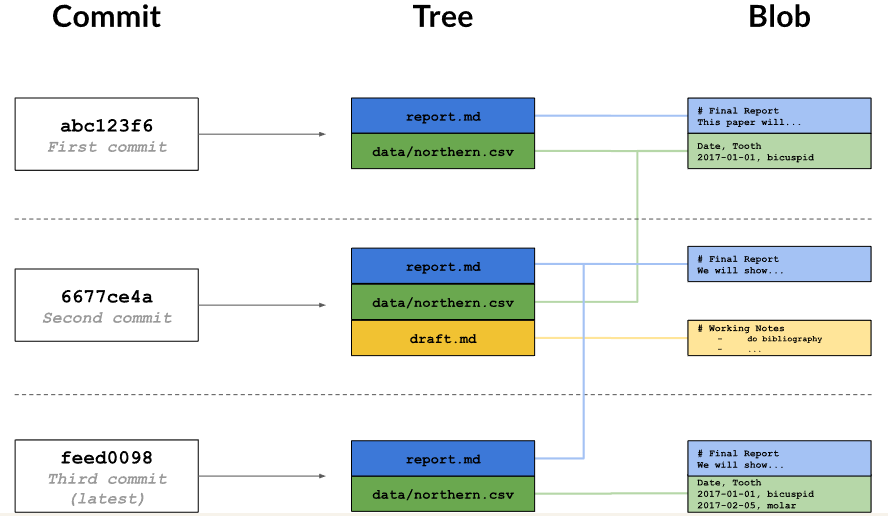

# Repositórios

## Diagrama do fluxo do versionamento




## Comandos

---
**`$ git show <hash>`**

Inserindo os primeiros (6) dígitos do hash de um commit visualizamos seus detalhes.

Ao invés de usar o hash de um commit podemos usar `HEAD` para obter o último commit e `HEAD~1` para obter o commit antes dele e assim por diante

---

**`$ git annotate <file>`**

Mostra mais detalhes das alterações feitas em um arquivo.
Exemplo:
```
04307054        (  Rep Loop     2017-09-20 13:42:26 +0000       1)# Seasonal Dental Surgeries (2017) 2017-18
5e6f92b6        (  Rep Loop     2017-09-20 13:42:26 +0000       2)
5e6f92b6        (  Rep Loop     2017-09-20 13:42:26 +0000       3)TODO: write executive summary.
```

Primeiro vem os primeiros dígitos do hash da alteração (imagino que o hash do commit que salvou a alteração, então se as duas linhas tem o mesmo hash então elas foram salvas ao mesmo tempo). Depois vem o autor da alteração (Rep Loop), a data, o número da linha alterada e a linha em sí.

---

**`$ git diff <hash>..<hash>`**

Mostra as diferenças entre dois commits específicos, lembrando: eu posso usar os primeiros 6 dígitos do hash. Exemplos:

`$ git diff abc123..def456`

`$ git diff HEAD~1..HEAD~3`

---

**`$ git clean -n`**

Mostra os arquivos que o git está ignorando por causa de `.gitignore`.

---

**`$ git clean -f`**

Exclui do repositório os arquivos que o git está ignorando.

---

**`$ git config --list`**

Esse comando mostras as configurações do git. O comando permite alguns argumentos:
- `--system`: Configurações para qualquer usuário no computador.
- `--global`: Configurações para todos os projetos.
- `--local`: Configurações para um projeto específico.

---

**`$ git config --global <setting> <value>`**

Isso muda uma configuração global para um dado valor. Exemplo:
`git config --global user.email guilhermecxe@hotmail.com` muda o email global. Para acessar o meu nome eu uso `user.name`.